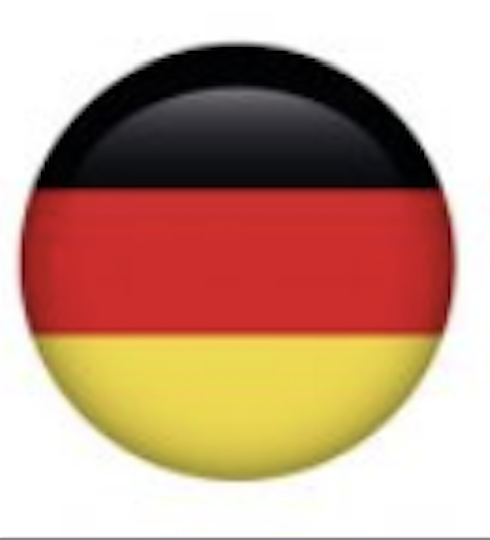

<div align="right" >
  <a href="./README.md">
    </img>
  </a>
  <a href="./README.de.md">
    </img>
  </a>
  <a href="./README.en.md">
    </img>
  </a>
</div>
<br/>

<div align="center">
  
  <br/>
  <span>BU bir README şablon deposu</span>
</div>

--- 

<br/>

Evet, az önce okuduğunuz şey bu: "bir README şablonu deposu".
Bunda, tüm projemin readme'larının bir padronizasyonunu tutacağım.

Bunları kopyalamaktan ve kendi amaçlarınız için değiştirmekten çekinmeyin

<br/>

**Here you will find the following templates:**

- [x] [In construction](./construction) - For those repos that doesn't have notthing yet <br/>

- [x] [All-in-one](./all-in-one) - The readme for monorepos <br/>

- [ ] [Mobile](./mobile) - A template for mobile apps <br/>

- [ ] [Server](./server) - For APIs and stuff<br/>

- [ ] [Web](./server) - To be used in frontend aplicattions <br/>

<br/>

Okay.. But *"why a multi-languaged readme"*?, you may ask.

Well.. if you're still here, let me tell ya a story:

<br/>

## :thinking: Should I make my READMEs in Portuguese or English?
<br/>

Even in the beggining of my journey doing READMEs, I was uncomfortable with this question. 
Well.. I live in Brazil and, even though some of us can comunicate in English very easilly, there is a huge percentage of us that can't.

Still, when making this question above, i've always got the **same answer**, almost instantly: 

> *"YOU SHOULD ALWAYS WRITE READMEs IN ENGLISH, SO EVERYONE WILL UNDERSTAND".*
>
> -- Comunity


As you can see, I wasn't convinced.

So, the only way was to do.. both.

<br/>

## :v: My answer is: Do both
<br/>

Considering github does not have any functionallity known by me (until this moment) as a "multi language support" or anything like that, I decided to use in this repo a known workaround that links another README file with the desired language.

If you notice, there is a "button" on the left-top of this file, like this:
  
[](./README.pt.md)

```
# you can do that this way:

[](./README.pt.md)

# or using an img tag in HTML

<a href="./README.pt.md">
  </img>
</a>
```

I've put this on every README file, which leads you to a "README.\< abreviation-of-choosen-language \>.md" (in this case, brasilian portuguese)

Simple as that.

<br/>

## :handshake: Contributions
<br/>

If you liked this repository and would like to contribute, just open a pull request and i'll happilly review it :white_heart:

And if you have any suggestion, just let me know :)

<br/>
<div align='center'>
 
[](https://git.io/typing-svg)
<p align="left">
  <a href="https://www.linkedin.com/in/fuat-sevin%C3%A7-6a7969217/" target="blank"></a>
<a href="https://codepen.io/fuatsevinc" target="blank"></a>  
  <a href="https://app.netlify.com/teams/fuatsevinc/overview" target="blank"></a>
<a href="https://twitter.com/FuatSevinc_" target="blank"></a>
<a href="https://www.instagram.com/fuatsevinc66/" target="blank"></a>
</p>
<p align="left">
- This is <a href="http://www.fuatsevinc.com" target="_blank">My Portfolio Website www.fuatsevinc.com</a>
</p>

</div>
